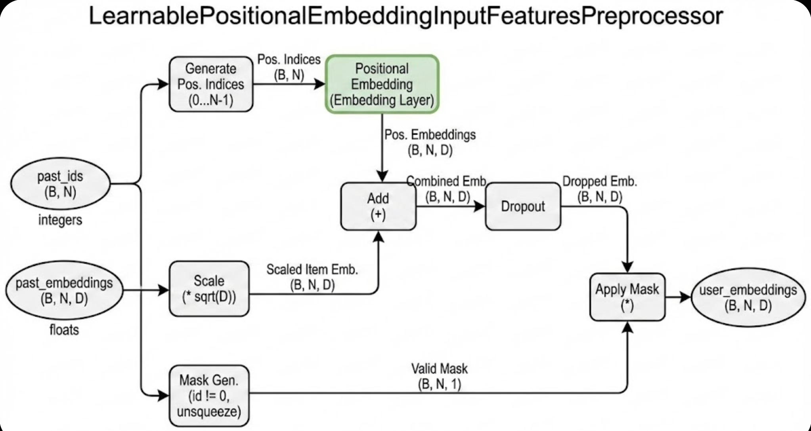

这段代码定义了一个名为 `LearnablePositionalEmbeddingInputFeaturesPreprocessor` 的 PyTorch 模块。它是推荐系统模型中的一个**输入特征预处理器**。

简单来说，它的作用是**把原始的输入数据（比如用户看过的商品序列）“打扮”好，送给后面的核心模型（通常是 Transformer 类模型）去处理。**

核心的“打扮”工作就是：告诉模型序列中每个商品到底排在第几个位置。

下面我将详细描述和解释这个模块的编码方式和作用。

-----

### 1\. 模块的核心作用：为什么需要它？

在处理序列数据（例如用户历史行为序列：[商品A, 商品B, 商品C]）时，传统的神经网络（如全连接网络）或者 Transformer 模型本身是**没有顺序概念**的。如果直接输入商品A、B、C的特征，模型无法区分“A在B前面”还是“B在A前面”。

为了解决这个问题，Transformer 架构引入了**位置嵌入（Positional Embedding）**。这个预处理器的核心任务就是实现这一机制。

它的具体作用包括四个方面：

1.  **注入位置信息：** 为序列中的每个元素加上一个代表其位置的向量。
2.  **数值缩放：** 平衡内容特征和位置特征的数值大小。
3.  **正则化：** 防止过拟合。
4.  **处理变长序列：** 通过掩码机制处理填充（Padding）数据。

-----

### 2\. 编码方式与实现细节解析

我们将分别从初始化和前向传播两个阶段来解析其代码实现。

#### 2.1. 初始化阶段 (`__init__` 和 `reset_state`)

这部分代码负责创建必要的组件和参数。

```python
def __init__(self, max_sequence_len: int, embedding_dim: int, dropout_rate: float) -> None:
    # ...
    # 1. 创建可学习的位置编码表
    self._pos_emb: torch.nn.Embedding = torch.nn.Embedding(
        max_sequence_len,
        embedding_dim,
    )
    # 2. 创建 Dropout 层
    self._emb_dropout = torch.nn.Dropout(p=dropout_rate)
    # 3. 初始化权重
    self.reset_state()

def reset_state(self) -> None:
    # 使用截断正态分布初始化位置编码权重
    truncated_normal(
        self._pos_emb.weight.data,
        mean=0.0,
        std=math.sqrt(1.0 / self._embedding_dim),
    )
```

**解释：**

  * **可学习的位置嵌入 (`self._pos_emb`):**
      * 这是核心组件。它是一个 `nn.Embedding` 层，本质上是一个大小为 `[max_sequence_len, embedding_dim]` 的查找表（矩阵）。
      * 表的第 0 行存储“位置0”的向量，第 1 行存储“位置1”的向量，以此类推。
      * **关键点：“可学习” (Learnable)**。与原始 Transformer 论文中使用固定的正弦/余弦函数不同，这里的实现让位置向量成为模型的参数。在训练过程中，模型会自动学习到什么样位置向量最能表达“先后顺序”或“相对距离”。
  * **权重初始化 (`reset_state`):**
      * 它不使用默认的随机初始化，而是使用截断正态分布。标准差设为 `1/√D` (D是嵌入维度)。这种初始化方式通常用于保持神经网络各层激活值的方差稳定，有助于模型训练初期的收敛。

#### 2.2. 前向传播阶段 (`forward`)

这部分代码是数据实际流经的路径，展示了预处理的具体步骤。

```python
def forward(self, ..., past_ids: torch.Tensor, past_embeddings: torch.Tensor, ...) -> ...:
    B, N = past_ids.size() # 获取批次大小(B)和序列长度(N)

    # --- 步骤 1: 缩放原始嵌入 & 添加位置嵌入 ---
    # past_embeddings: 输入的商品内容向量，形状 [B, N, D]
    user_embeddings = past_embeddings * (self._embedding_dim**0.5) + self._pos_emb(
        torch.arange(N, device=past_ids.device).unsqueeze(0).repeat(B, 1)
    )

    # --- 步骤 2: 应用 Dropout 正则化 ---
    user_embeddings = self._emb_dropout(user_embeddings)

    # --- 步骤 3: 生成并应用有效掩码 (Masking) ---
    # 假设 ID 为 0 的是填充项
    valid_mask = (past_ids != 0).unsqueeze(-1).float()  # [B, N, 1]
    user_embeddings *= valid_mask

    # 返回处理后的嵌入和掩码
    return past_lengths, user_embeddings, valid_mask, None
```

**详细原理解释：**

**步骤 1：缩放与位置叠加 (Scaling & Positional Addition)**

这是最关键的一行代码：
`user_embeddings = past_embeddings * (self._embedding_dim**0.5) + self._pos_emb(...)`

1.  **为什么要乘以 `sqrt(embedding_dim)` (即 `_embedding_dim**0.5`)？**

      * 这是一个源自 Transformer 原始论文（"Attention Is All You Need"）的标准操作。
      * 输入的 `past_embeddings` 通常是通过某些初始化方法得到的，其数值可能比较小。而接下来要加上的位置嵌入的数值可能相对较大。
      * 如果直接相加，位置信息可能会“淹没”掉商品本身的内容信息。
      * 乘以维度的平方根可以将商品内容嵌入的数值放大到与位置嵌入相当的量级，使两者在后续计算中具有相近的权重。

2.  **如何添加位置嵌入？**

      * `torch.arange(N)`: 生成一个序列 `[0, 1, 2, ..., N-1]`，代表序列中的位置索引。
      * `.unsqueeze(0).repeat(B, 1)`: 将这个索引序列复制 B 份（B是批次大小），形成形状为 `[B, N]` 的位置索引矩阵。
      * `self._pos_emb(...)`: 拿着这些索引去位置嵌入表中查表。位置0取出向量 $P_0$，位置1取出向量 $P_1$。得到形状为 `[B, N, D]` 的位置向量张量。
      * **相加 (`+`)**: 将缩放后的【商品内容向量】与查表得到的【位置向量】进行逐元素相加。
      * **结果**: 现在的 `user_embeddings` 中的每一个向量，既包含了“它是什么商品”的信息，也包含了“它在第几个位置”的信息。

**步骤 2：Dropout 正则化**

`user_embeddings = self._emb_dropout(user_embeddings)`

  * 在训练过程中随机将一部分神经元的输出置零。这是一种标准的防止过拟合的技术，迫使模型学习更加鲁棒的特征。

**步骤 3：掩码处理 (Masking)**

  * **背景**: 在实际应用中，用户的行为序列长度是不一样的。为了组成一个批次 (Batch) 进行并行计算，短序列的末尾会被填充 (Padding) 特定的 ID（通常是 0），直到达到最大长度 `N`。
  * `valid_mask = (past_ids != 0).unsqueeze(-1).float()`:
      * 这行代码识别出哪些位置是真实数据（ID不等于0），哪些是填充数据。生成一个由 1.0 和 0.0 组成的掩码矩阵，形状为 `[B, N, 1]`。
  * `user_embeddings *= valid_mask`:
      * 将嵌入向量与掩码相乘。结果是，所有填充位置的嵌入向量都会变成全 0 向量。
      * **作用**: 确保模型在后续计算注意力机制（Attention）时，不会关注到这些无意义的填充位置。

### 总结

这个 `LearnablePositionalEmbeddingInputFeaturesPreprocessor` 模块是一个遵循 Transformer 标准范式的、基础但功能完备的预处理器。

它的核心编码逻辑是：**通过维护一个可训练的查找表，为序列中的每个位置学习一个独特的向量表示，并将这个位置向量叠加到输入的元素向量上，从而赋予模型感知序列顺序的能力。** 同时，它还负责了必要的数值缩放、正则化和填充位屏蔽工作。


这是一个非常好的问题！触及了 Transformer 架构的核心设计选择之一。

你提供的代码中使用的“可学习位置嵌入 (Learnable Positional Embedding)”是目前工业界（例如 BERT, GPT-2/3 等大模型）最常采用的方案，因为实现简单且效果很好。

但是，确实存在其他方案。你提到的“Attention Is All You Need”论文中的正余弦编码就是最经典的替代方案，通常被称为\*\*“固定位置编码 (Fixed / Sinusoidal Positional Encoding)”\*\*。

我们从最基础的开始谈起，然后重点分析正余弦编码。

### 1\. 有没有更简单、更基础的编码？

如果我们追求极致的“简单”，不考虑效果，确实有更基础的方法：

#### 方法 A：直接使用位置索引（Integer Encoding）

最直接的想法是：第一个词的位置是 1，第二个是 2，以此类推。

  * **做法**：直接把位置的整数 index 加到输入特征上（或者作为一个单独的特征输入）。
  * **为什么不用**：神经网络不喜欢数值跨度很大的整数输入。对于长序列，位置 1000 的数值远大于位置 1，这会导致模型训练不稳定，且难以泛化。模型很难从单一数值中学习到复杂的相对位置关系。

#### 方法 B：归一化索引（Normalized Index）

为了解决数值过大的问题，可以将索引归一化到 [0, 1] 之间。

  * **做法**：位置值 = `当前位置索引 / 最大序列长度`。
  * **为什么不用**：对于不同长度的序列，同一个归一化值代表的实际物理距离不同。例如，在长度为 10 的序列中，0.5 代表位置 5；在长度为 100 的序列中，0.5 代表位置 50。这让模型感到困惑。

**结论：** 在深度学习中，真正实用的“最基础”方案，其实就是你提到的**正余弦编码**。虽然它的数学公式看起来有点复杂，但从实现原理上讲，它比“可学习嵌入”更基础，因为它不需要训练任何参数。

-----

### 2\. 解析“Attention Is All You Need”中的正余弦编码

在 Transformer 的原始论文中，作者并没有使用可学习的 Embedding 层，而是使用了一组固定的数学公式来生成位置向量。

#### 核心思想

既然我们需要给每个位置一个独特的向量，不如用不同频率的正弦和余弦函数来生成这些向量。

你可以把它想象成一个有许多指针的时钟。有的指针转得非常快（高频），有的指针转得非常慢（低频）。不同位置就像是在不同时间点给这些时钟拍照，指针组合的状态是独一无二的。

#### 公式与实现

对于位置 `pos`，其位置向量的第 `i` 个维度的值通过以下公式计算（假设嵌入维度为 $D$）：

  * 偶数维度 $2i$: $PE(pos, 2i) = \sin(pos / 10000^{2i/D})$
  * 奇数维度 $2i+1$: $PE(pos, 2i+1) = \cos(pos / 10000^{2i/D})$

**PyTorch 实现代码对比：**

为了直观对比，我写一个对应的正余弦编码预处理器（替代你原来的 `__init__` 和 `forward` 中的相关部分）：

```python
import torch
import torch.nn as nn
import math

class SinusoidalPositionalEncoding(nn.Module):
    """
    'Attention Is All You Need' 中的固定正余弦位置编码
    """
    def __init__(self, max_sequence_len: int, embedding_dim: int, dropout_rate: float):
        super().__init__()
        self._embedding_dim = embedding_dim
        self._emb_dropout = nn.Dropout(p=dropout_rate)

        # --- 关键区别开始 ---
        # 不再创建 nn.Embedding，而是创建一个固定的矩阵 (Buffer)
        # 这个矩阵在训练过程中不会更新
        pe = torch.zeros(max_sequence_len, embedding_dim)
        position = torch.arange(0, max_sequence_len, dtype=torch.float).unsqueeze(1)

        # 计算分母中的频率项
        div_term = torch.exp(torch.arange(0, embedding_dim, 2).float() * (-math.log(10000.0) / embedding_dim))

        # 填充偶数维度用 sin
        pe[:, 0::2] = torch.sin(position * div_term)
        # 填充奇数维度用 cos
        pe[:, 1::2] = torch.cos(position * div_term)

        # 增加一个 batch 维度: [1, max_len, dim]
        pe = pe.unsqueeze(0)

        # register_buffer 告诉 PyTorch 这是一个不需要计算梯度的张量，
        # 但是需要随着模型状态一起保存和加载。
        self.register_buffer('pe', pe)
        # --- 关键区别结束 ---

    def forward(self, past_embeddings: torch.Tensor, past_ids: torch.Tensor):
        B, N, D = past_embeddings.size()

        # 1. 缩放 (和原来一样)
        user_embeddings = past_embeddings * math.sqrt(self._embedding_dim)

        # 2. 添加固定位置编码 (关键区别)
        # 直接从预计算好的 buffer 中切片取出前 N 个位置
        # self.pe 的形状是 [1, max_len, D]，可以自动广播到 [B, N, D]
        user_embeddings = user_embeddings + self.pe[:, :N, :]

        # 3. Dropout (和原来一样)
        user_embeddings = self._emb_dropout(user_embeddings)

        # ... 后续省略掩码处理 ...
        return user_embeddings

```

### 3\. 两种编码方式的深度对比

现在我们可以清晰地对比你提供的代码（可学习）和正余弦编码（固定）了。

| 特性 | 可学习位置嵌入 (你的代码) | 正余弦位置编码 (Attention Paper) |
| :--- | :--- | :--- |
| **本质** | 一个可训练的查找表矩阵 (`nn.Embedding`) | 一组固定的数学公式生成的常量矩阵 |
| **参数量** | **多**。需要 `max_len * embedding_dim` 个参数。 | **零**。不需要任何可训练参数。 |
| **灵活性** | **高**。模型可以根据数据学习到任何它认为“好”的位置表示。 | **低**。位置表示是人为设定的，固定死的。 |
| **序列长度泛化** | **差**。无法处理长度超过训练时设定的 `max_sequence_len` 的序列。 | **理论上好**。公式可以计算任何位置的值，理论上可以推演到更长的序列（但实际效果可能会下降）。 |
| **相对位置感知** | 模型需要隐式地学习。 | **显式支持**。由于三角函数特性，线性变换很容易捕捉相对偏移（例如，$PE_{pos+k}$ 可以表示为 $PE_{pos}$ 的线性函数）。 |
| **实现难度** | 非常简单（一行 `nn.Embedding`）。 | 稍复杂（需要写公式计算，注意奇偶维度）。 |
| **主流应用** | BERT, GPT系列, 大部分推荐系统 | 原始 Transformer, 较早期的 NLP 模型 |

### 4\. 总结与建议

1.  **为什么原始论文用正余弦？**
    在 Transformer 刚提出时，研究人员希望模型能够具有处理比训练集更长序列的能力（泛化能力），并且看重正余弦函数天然自带的相对位置关系属性。此外，减少参数量在当时也是一个考量。

2.  **为什么现在流行用可学习嵌入（如你提供的代码）？**
    随着数据量的爆炸和计算能力的提升，增加一些参数不再是负担。实践证明，在足够多的数据下，让模型自己去“学习”什么是最好的位置表示，往往比人为设计固定的公式效果更好，也更简单直接。特别是在推荐系统里，序列长度通常是固定的，不需要外推到特别长的序列。

**结论：**

你提供的代码是目前最实用、最主流的选择。正余弦编码虽然数学上更“基础”且无需参数，但在实际工程应用中，可学习嵌入往往能获得更好或持平的效果，且实现更简单。理解这两种方式的区别，有助于你更深入地理解 Transformer 的机制。
